  <!-- Custom Neon Animated Banner -->
  
  
   

  <!-- Animated Typing Subtitle -->
  

   

  <!-- Cohesive Badges -->
  
  &nbsp;&nbsp;
  

 

  

## 🌌 About me

<table>
  <tr>
    <td valign="top" width="55%" style="border: none;">
      I am a <b>Full Stack Engineer</b> specialized in designing, implementing, and optimizing high-throughput backend services, robust architectures, and responsive applications. Leveraging a strong foundation in systems programming (C++, Java) and high-level application development (Python, JavaScript), I focus on building scalable, reliable, and high-performance software.
        
      <ul>
        <li><b>Backend & Systems Design</b>: Engineering efficient server-side architectures, REST/GraphQL APIs, and robust data schemas using Java (Spring Boot), Python, and C++.</li>
        <li><b>Software Architecture</b>: Designing clean, maintainable systems and microservice communications built to scale.</li>
        <li><b>Performance & Optimization</b>: Implementing caching mechanisms (Redis), optimizing database queries, and profiling system bottlenecks.</li>
        <li><b>Full-Cycle Engineering</b>: Delivering reliable, end-to-end software solutions, from memory-safe algorithms to responsive user interfaces.</li>
      </ul>
    </td>
    <td valign="top" width="45%" align="center" style="border: none;">
      
    </td>
  </tr>
</table>

 

  

## 📂 Featured Projects

  <table>
    <tr>
      <td align="center" width="50%" style="border: none;">
        
      </td>
      <td align="center" width="50%" style="border: none;">
        
      </td>
    </tr>
  </table>

 

  

## 🛠️ Tech Stack & Ecosystem

### 💻 Languages

  &nbsp;
  &nbsp;
  &nbsp;
  &nbsp;
  &nbsp;
  

### ⚡ Frameworks & Libraries

  &nbsp;
  &nbsp;
  &nbsp;
  &nbsp;
  &nbsp;
  

### 🗄️ Databases & Caching

  &nbsp;
  &nbsp;
  &nbsp;
  

### 🔧 Tools & Cloud

  &nbsp;
  &nbsp;
  &nbsp;
  

 

  

## 📊 GitHub Analytics

  <table>
    <tr>
      <td align="center" width="50%" style="border: none;">
        
      </td>
      <td align="center" width="50%" style="border: none;">
        
      </td>
    </tr>
    <tr>
      <td align="center" colspan="2" style="border: none;">
         
        
      </td>
    </tr>
  </table>

 

  

  <h3>🎨 Contribution Artwork</h3>
  

 

  <h3>👾 Contribution Game</h3>
  

 

  

  <h3>🏆 Unlocked Achievements</h3>
  
Here are some of the official GitHub achievements earned on my profile. Check out my <a href="https://github.com/saisaran-m/github-badges">GitHub Badges Guide</a> repository to learn how to unlock them!

  
  <table style="border: none;">
    <tr>
      <td align="center" width="25%" style="border: none;">
        
         
        <b>Quickdraw</b>
      </td>
      <td align="center" width="25%" style="border: none;">
        
         
        <b>YOLO</b>
      </td>
      <td align="center" width="25%" style="border: none;">
        
         
        <b>Pair Extraordinaire</b>
      </td>
      <td align="center" width="25%" style="border: none;">
        
         
        <b>Pull Shark</b>
      </td>
    </tr>
  </table>

 

  

  <h3>⚡ Let's build something insane together!</h3>

